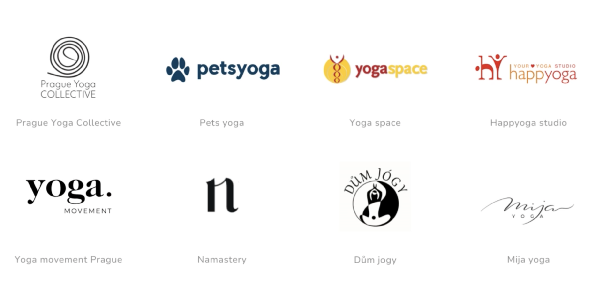
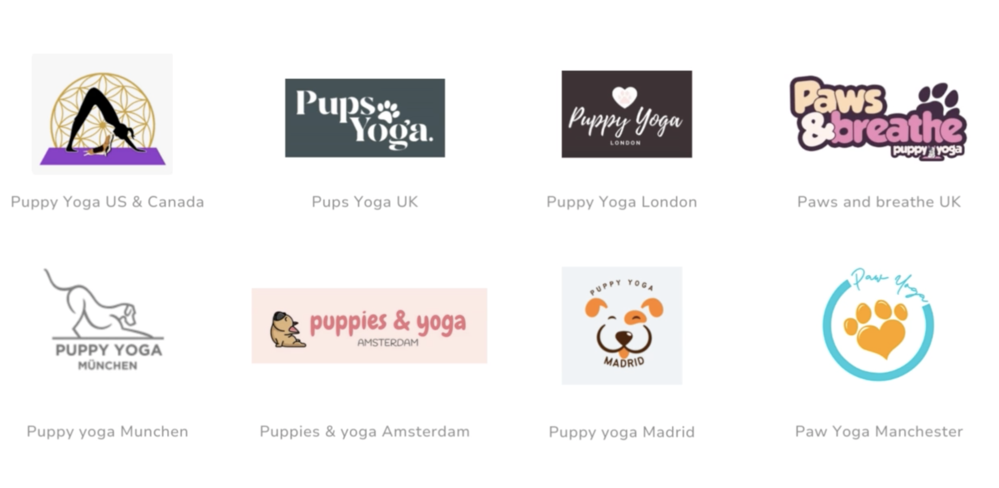
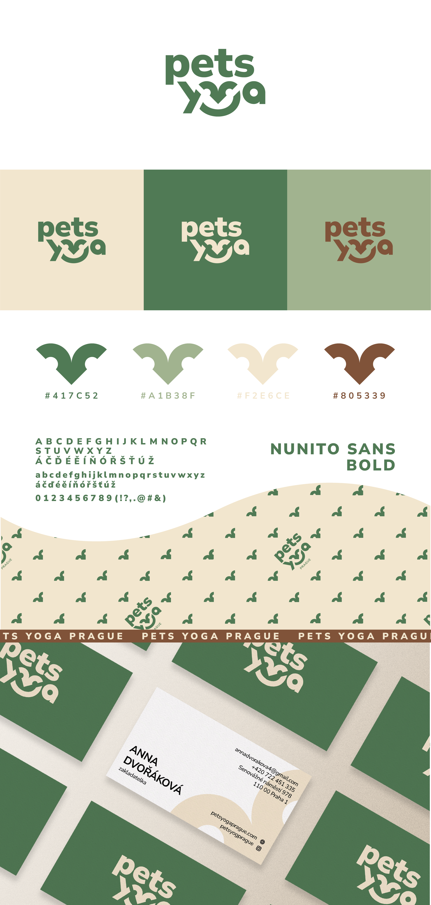

# Pets Yoga Prague

PETS Yoga Prague offers something truly unique — yoga sessions with puppies. It’s calming, fun and cute. But their original visual identity didn’t reflect that at all. It felt flat and generic, and it didn’t help them stand out.
They needed a brand that would feel professional and trustworthy, but also playful, warm and easy to connect with — just like the experience itself.

I created a full rebranding concept that keeps things simple, memorable and emotionally engaging. My goal was to find a perfect balance between *professionalism* and *cuteness*, without going into anything too childish.
So I started with simmilar brands research. I needed to do it differently, to make them stand out.

## Market analysis

**czech market research**

**european market research**

| Overcomplicated design      | Too much emmphasis on cuteness | The paw symbol overuse     |
| :---        |    :----:   |          ---: |
| difficult for the customer to remember      | logos can appear cheap, unworthy       | symbol becomes ineffective   |
|    | brand becomes less trustworthy        |       |

## Design process

The goal based on the market research and client's requremets was to create:

- **differentation from the competition**
- **proffesional look**
- **simple and memorable design**
- **emotional feel** 

So I started sketching and brainstorming my ideas on the paper, trying to find the ideal combination.
I knew I wanted to in cocporate somehow thy symbol of the dog's head or nose, ears. Anything related to pets, but not the paw! I really wanted to avoid typical “pet branding” clichés — I wanted something more thoughtful and modern, something people would remember. I wanted to create a lovebrand visual.

/ photo of the firts sketches /

It was really challenging, to match all theese requrements. During the process, I started to be a little frustrated, so I also tried to work with the paw symbol, even if I knew, this symbol is so overused... nothing just seemd to work out. I was struggling with overcomplicated designs, poor readability or too "childish" look.

It took a few rounds of adjustments to find the right balance between creativity and clarity. But then the idea started to form itself on the paper.

/ Pets yoga logo sketches /

## New logo was born

The logo is based on a friendly geometric font with a playful twist — the “Y” turns into a puppy nose and smile, suggesting pet symbol and joy, but also meditating figure sitting in lotus position. 

Along with that, I developed:

- A soft, earthy, calming color palette inspired by nature
- Bold but friendly typography (Nunito Sans)
- Custom brand elements and patterns
- Business cards, posters, rollups, metro banners

Everything was designed to feel calm, friendly and full of positive energy — just like the sessions themselves.

The branding was fully realized and implemented — from print to online. The client was really happy with the final result and felt that the new look finally matched the atmosphere of their events.

For me, this project was a great opportunity to combine emotional storytelling with clean, effective design. And honestly? It made me smile every time I worked on it.
